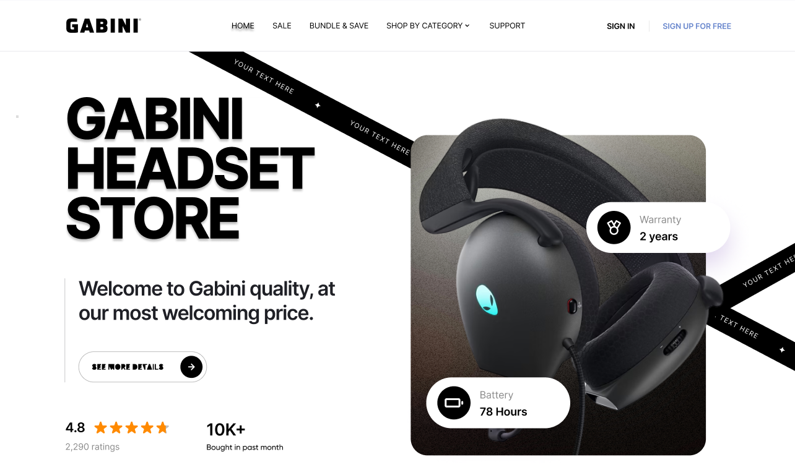

# Gabini Store

## Descrição do Projeto
O Uniside é um projeto que tem como objetivo transformar um mockup funcional criado no Figma em um site completamente interativo utilizando Vue.js. A aplicação busca trazer à vida o design proposto, garantindo uma experiência fluida e responsiva para os usuários.

## Objetivo Principal
O principal objetivo do Uniside é implementar um site a partir de um mockup funcional, respeitando o design original e garantindo a melhor experiência de usuário possível.

## Ferramentas e Tecnologias Utilizadas
- **Frontend**: Vue 3
- **Ferramenta de Build**: Vite
- **Design**: Mockup funcional desenvolvido no Figma
- **Controle de Versão**: Git

## Desenvolvimento e Implementação

### Passos Principais no Desenvolvimento
1. Análise do Mockup: Entendimento e mapeamento das funcionalidades e interações.
2. Design Responsivo: Implementação de um layout adaptável para diferentes dispositivos.
3. Implementação das Funcionalidades: Desenvolvimento de funcionalidades interativas e responsivas com Vue.js.
4. Testes Contínuos: Validação do site em diferentes navegadores e dispositivos para garantir consistência.

### Resultados Obtidos
- Implementação de páginas responsivas
- Funcionalidades interativas desenvolvidas com Vue.js
- Integração perfeita entre design e funcionalidade

## Gabini Headset Store - Interface



A página inicial da **Gabini Headset Store** 


## Requisitos do Sistema
- Vue.js
- npm

## Configuração do Ambiente de Desenvolvimento

1. **Clone o repositório**:
   ```bash
   git clone https://github.com/FelipeAraujoOliveira/Projeto_Eficaz.git
   ```

2. **Instale as dependências**:
   ```bash
   cd gabini_store
   npm install
   ```

3. **Compile e inicie para desenvolvimento**:
   ```bash
   npm run dev
   ```

4. **Abra o projeto no navegador**:
   - Após rodar `npm run dev`, o projeto estará disponível localmente no endereço indicado no terminal.
